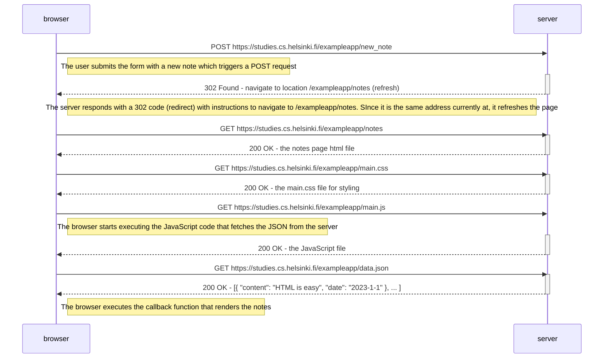

# Diagram 0.4

```mermaid
sequenceDiagram
    participant browser
    participant server

    browser->>server: POST https://studies.cs.helsinki.fi/exampleapp/new_note
    Note right of browser: The user submits the form with a new note which triggers a POST request
    activate server
    server-->>browser: 302 Found - navigate to location /exampleapp/notes (refresh)
    deactivate server
    Note right of browser: The server responds with a 302 code (redirect) with instructions to navigate to /exampleapp/notes. SInce it is the same address currently at, it refreshes the page
    browser->>server: GET https://studies.cs.helsinki.fi/exampleapp/notes
    activate server
    server-->>browser: 200 OK - the notes page html file
    deactivate server

    browser->>server: GET https://studies.cs.helsinki.fi/exampleapp/main.css
    activate server
    server-->>browser: 200 OK - the main.css file for styling
    deactivate server

    browser->>server: GET https://studies.cs.helsinki.fi/exampleapp/main.js
    Note right of browser: The browser starts executing the JavaScript code that fetches the JSON from the server
    activate server
    server-->>browser: 200 OK - the JavaScript file
    deactivate server

    

    browser->>server: GET https://studies.cs.helsinki.fi/exampleapp/data.json
    activate server
    server-->>browser: 200 OK - [{ "content": "HTML is easy", "date": "2023-1-1" }, ... ]
    deactivate server

    Note right of browser: The browser executes the callback function that renders the notes
```
