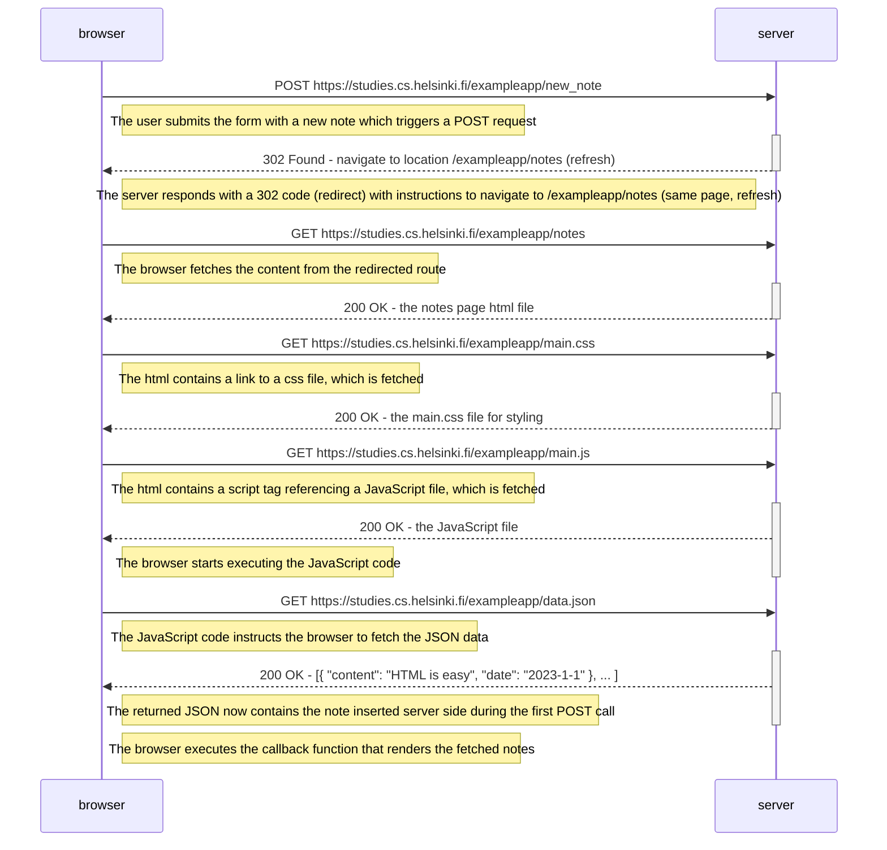

# Diagram 0.4
In the section Loading a page containing JavaScript - review, the chain of events caused by opening the page https://studies.cs.helsinki.fi/exampleapp/notes is depicted as a sequence diagram. Create a similar diagram depicting the situation where the user creates a new note on the page https://studies.cs.helsinki.fi/exampleapp/notes by writing something into the text field and clicking the Save button.

If necessary, show operations on the browser or on the server as comments on the diagram.

The diagram does not have to be a sequence diagram. Any sensible way of presenting the events is fine.

All necessary information for doing this, and the next two exercises, can be found in the text of this part. The idea of these exercises is to read the text once more and to think through what is going on there. Reading the application code is not necessary, but it is of course possible.

You can do the diagrams with any program, but perhaps the easiest and the best way to do diagrams is the Mermaid syntax that is now implemented in GitHub Markdown pages!

