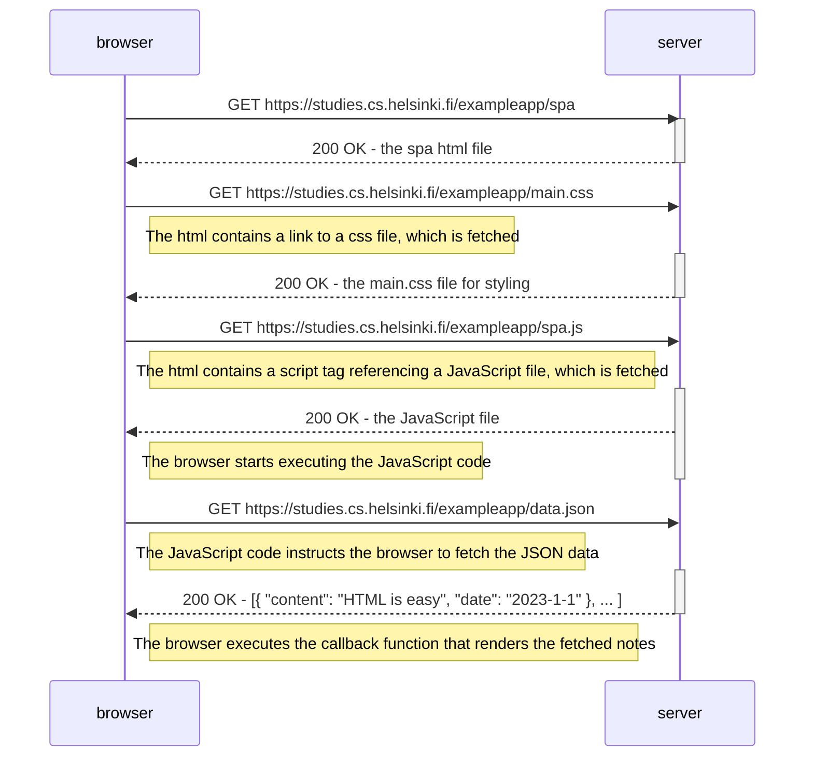

# Diagram 0.5

```mermaid
sequenceDiagram
    participant browser
    participant server

    browser->>server: GET https://studies.cs.helsinki.fi/exampleapp/spa
    activate server
    server-->>browser: 200 OK - the spa html file
    deactivate server

    browser->>server: GET https://studies.cs.helsinki.fi/exampleapp/main.css
    Note right of browser: The html contains a link to a css file, which is fetched
    activate server
    server-->>browser: 200 OK - the main.css file for styling
    deactivate server

    browser->>server: GET https://studies.cs.helsinki.fi/exampleapp/spa.js
    Note right of browser: The html contains a script tag referencing a JavaScript file, which is fetched
    activate server
    server-->>browser: 200 OK - the JavaScript file
    Note right of browser: The browser starts executing the JavaScript code
    deactivate server

    browser->>server: GET https://studies.cs.helsinki.fi/exampleapp/data.json
    Note right of browser: The JavaScript code instructs the browser to fetch the JSON data
    activate server
    server-->>browser: 200 OK - [{ "content": "HTML is easy", "date": "2023-1-1" }, ... ]
    deactivate server

    Note right of browser: The browser executes the callback function that renders the fetched notes
```
